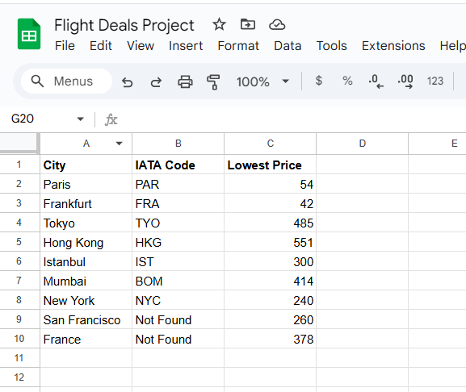

# Flight Deal Finder

This project is a Python-based flight deal finder that uses APIs to search for the cheapest flights from a specified origin to multiple destinations. It retrieves current flight information, checks for deals, and compares the prices with previously saved data.

## Project Structure

- **data_manager.py**  
  Manages data storage, retrieval, and updates. The `DataManager` class interfaces with a Google Sheet or any preferred data source to store destination data, including the lowest recorded prices for each destination.

- **flight_search.py**  
  Contains the `FlightSearch` class, which handles the flight search logic by interacting with a flight search API. It fetches flight details, including destination codes and prices.

- **flight_data.py**  
  Manages flight data processing and filtering. Includes a function `find_cheapest_flight` to find and return the flight with the lowest price from the retrieved data.

## Code Explanation

1. **Setup**: The `DataManager` retrieves destination data from a Google Sheet or local storage, which includes cities, IATA codes, and lowest recorded prices.
2. **Flight Search Initialization**: The script uses `FlightSearch` to fetch the IATA code for destinations without one.
3. **Flight Check**: Searches for available flights between the origin (`LON` in this example) and each destination, within a date range from the next day to six months out.
4. **Price Comparison**: Compares current flight prices with previously recorded lowest prices and prints a message if a cheaper price is found.

## Features
    - Dynamic IATA Code Retrieval: Automatically fetches IATA codes for destinations missing them.
    - Flight Price Comparison: Compares current flight prices against previously recorded prices and alerts if a lower price is available.
    - Rate Limiting: Adds pauses to prevent hitting API rate limits.
    - Real-Time Price Alerts: Notifies users if a new deal is found for any destination.

## Demo
