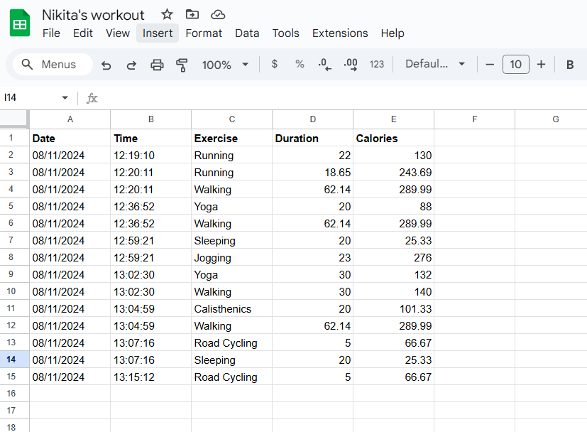

# Google Sheet Exercise Tracker
This Python project is an Exercise Tracker application that leverages the Nutritionix API to log exercises and calculate calories burned, and uses the Sheety API to store exercise details in a Google Sheets document. The project securely manages sensitive information with environment variables and supports multiple authentication methods: no authentication, Basic Authentication, and Bearer Token Authentication.

# Requirements
    - Python 3.x
    - requests, python-dotenv(for managing environment variables) library

# Usage
    - Send the exercise data to the Nutritionix API to retrieve calories burned.
    - Format the response and save the data to your Sheety database (e.g., a Google Sheet) using one of the authentication methods specified.

