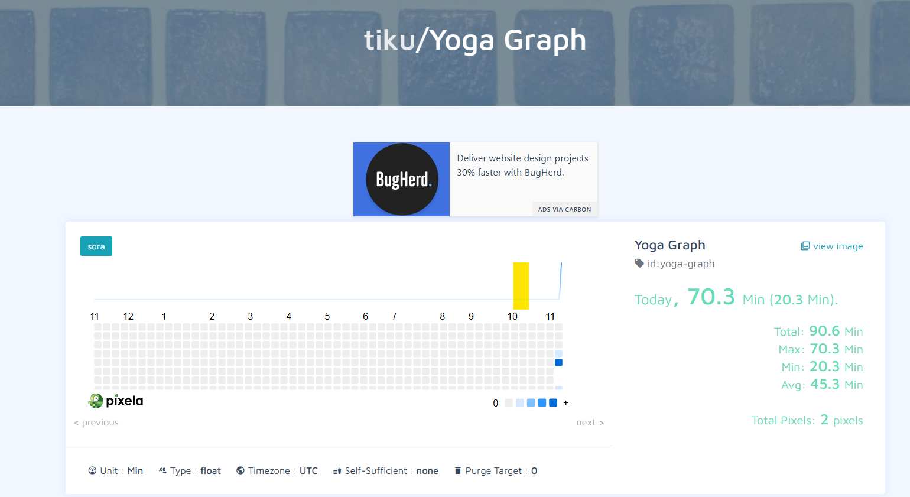

# Pixela Yoga Tracker

This Python project interacts with the Pixela API to create and update a graph for tracking yoga sessions. Each entry logs the duration of the yoga session in minutes.

## Requirements

- Python 3
- `requests` library

## Usage
The code performs the following steps:

- Create a User on Pixela (commented out by default).
- Create a Graph to visualize yoga sessions (commented out by default).
- Log a Yoga Session by adding a pixel to the graph.

